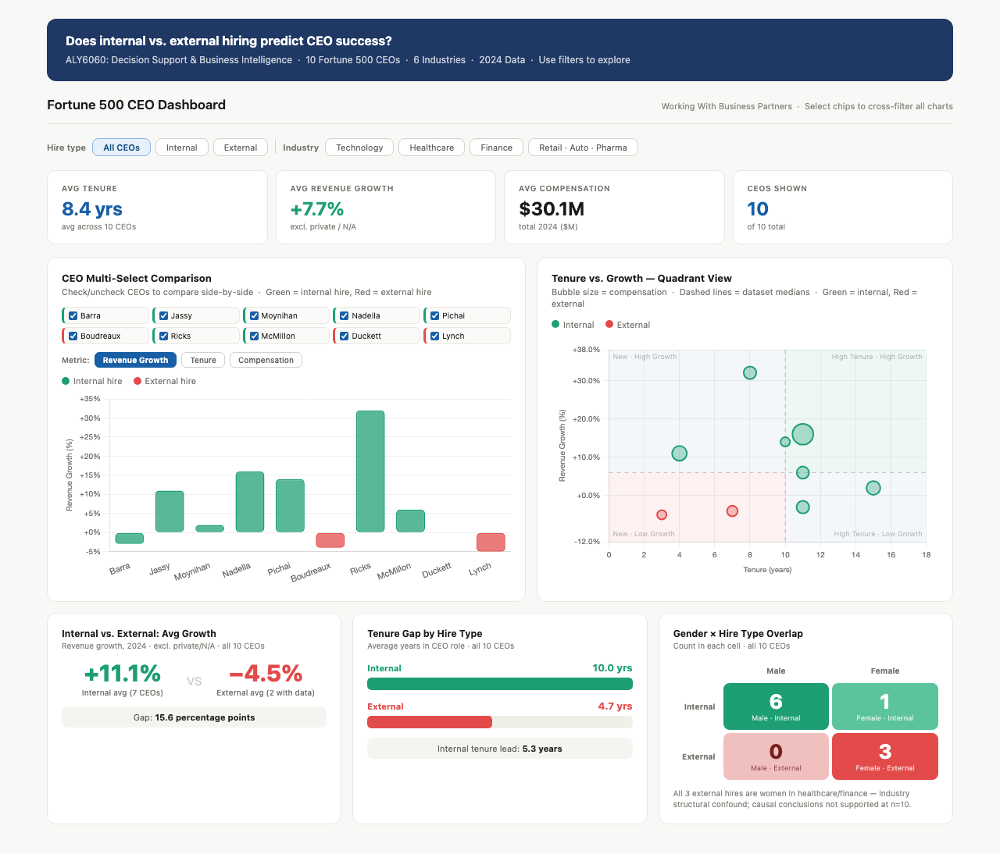

# ALY6060: Decision Support & Business Intelligence
## Assignment 3 — Working With Business Partners

---

## Dashboard Preview

---

## Core Research Question

> **Does internal vs. external hiring predict CEO success?**

Analysis of 10 Fortune 500 CEOs across 6 industries using 2024 data — examining tenure, revenue growth, compensation, gender representation, and CEO-to-worker pay ratios.

---

## Files

| File | Description |
|------|-------------|
| `Working_With_Business_Partners_FINAL.docx` | APA 7th edition report — business partner model analysis + CEO data findings |
| `CEO_Dashboard.html` | Interactive dashboard — open in any browser, no install needed |
| `CEO_Dashboard_Data.xlsx` | Fortune 500 CEO dataset — used for Qlik Cloud Analytics visualization |

---

## Dashboard

The HTML dashboard (`CEO_Dashboard.html`) is fully interactive and runs offline in any browser.

**Features:**
- Multi-CEO comparison bar chart with per-CEO checkboxes and metric toggle (Growth / Tenure / Compensation)
- Quadrant scatter chart: Tenure vs. Growth with median lines, bubble size = compensation
- Visual insight cards: avg growth comparison, tenure gap bars, gender × hire type 2×2 grid
- Live cross-filtering by hire type (Internal / External) and industry
- KPI tiles that update dynamically with every filter selection

**To run it:** Download `CEO_Dashboard.html` → double-click → opens in browser.

---

## Key Findings

| Metric | Internal Hires (8) | External Hires (3) |
|--------|-------------------|-------------------|
| Avg tenure | 10.1 years | 4.7 years |
| Avg revenue growth (2024) | +9.6% | −4.7% |
| Avg compensation | ~$35.4M | ~$16.8M |

**Critical caveat:** All 3 external hires are women in healthcare/finance — both sectors faced severe structural headwinds in 2024 (Medicare Advantage reform, Medicaid pressure). Industry effects cannot be fully separated from hire-type effects at n=10. Causal conclusions are not supported by this dataset alone.

---

## CEO Dataset

| CEO | Company | Hire Type | Tenure | 2024 Rev Growth |
|-----|---------|-----------|--------|-----------------|
| Mary Barra | General Motors | Internal | 11 yrs | −3% |
| Andy Jassy | Amazon | Internal | 4 yrs | +11% |
| Brian Moynihan | Bank of America | Internal | 15 yrs | +2% |
| Satya Nadella | Microsoft | Internal | 11 yrs | +16% |
| Sundar Pichai | Alphabet | Internal | 10 yrs | +14% |
| Gail Boudreaux | Elevance Health | External | 7 yrs | −4% |
| David Ricks | Eli Lilly | Internal | 8 yrs | +32% |
| Doug McMillon | Walmart | Internal | 11 yrs | +6% |
| Thasunda Duckett | TIAA | External | 4 yrs | N/A* |
| Karen Lynch | CVS Health | External | 3 yrs | −5% |

*TIAA is private — revenue growth not publicly disclosed. Karen Lynch removed Oct 2024.

---

## Report Structure

The written report follows **APA 7th edition** formatting and covers:

1. **Introduction** — business partner model background and research questions
2. **Defining the Business Partner Concept** — Ulrich (1997) framework
3. **Why the Business Partner Concept Fails** — role capture and competency deficit
4. **Tactics to Overcome Failure** — dual reporting structures + mandatory business fluency gates
5. **Qlik Dashboard Analysis** — 4 findings from CEO dataset with confounding variable analysis
6. **Conclusion** — structural accountability over stated intention

---

## Peer-Reviewed References

All academic citations are from peer-reviewed journals:

- Bennett et al. (2024) — *Human Resource Management Journal* — doi:10.1111/1748-8583.12538
- Gerpott (2015) — *German Journal of Research in HRM* — doi:10.1688/ZfP-2015-03-Gerpott
- McCracken et al. (2017) — *Human Resource Management Journal* — doi:10.1111/1748-8583.12125
- Pritchard (2010) — *Human Resource Management Journal* — doi:10.1111/j.1748-8583.2009.00107.x
- Ulrich (1997) — *Human Resource Champions* — Harvard Business School Press
- Wach et al. (2022) — *International Journal of HRM* — doi:10.1080/09585192.2021.1943490

---

## Data Sources

- SEC proxy filings (2024) — compensation and CEO-to-worker ratios
- Fortune.com — Fortune 500 rankings and women CEO data
- Company annual reports (2024) — revenue growth figures

---

*ALY6060: Decision Support & Business Intelligence · Northeastern University*
